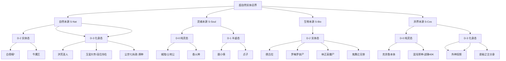

# 超自然实体分类树形图（Mermaid可视化）

本图展示"本源（Source）× 维度（Dimension）"双轴模型的完整层级结构。

> **说明**：  
> *白骨精的坐标标注为 (S-Nat, D-2)，但其物质基础源于人类尸骨，存在S-Soul的残留痕迹。详见[白骨精词条](./entities/bai-gu-jing.md)。  
> 本树形图将随新实体的收录而动态更新。同一实体如具有多维显形能力（如克苏鲁），可同时归属多个D代码。
