# 超自然实体分类树形图（Mermaid可视化）

本图展示“本源（Source）× 维度（Dimension）”双轴模型的完整层级结构。

> **说明**：本树状图展示的是**类别示例**，而非穷尽枚举。每个节点代表一个功能性类型，可容纳多个具体案例。

```mermaid
graph TD
    A[超自然实体总界] --> B[自然本源 S-Nat]
    A --> C[灵魂本源 S-Soul]
    A --> D[生物本源 S-Bio]
    A --> E[异界本源 S-Cos]
    A --> F[规则本源 S-Rule]
    A --> G[概念本源 S-Concept]

    %% 自然本源 (S-Nat)
    B --> B1[D-1 半虚态]
    B --> B2[D-2 实体态]
    B --> B3[D-3 化身态]
    B1 --> B1a[精魅·自然灵]
    B2 --> B2a[动物/物品成精]
    B2 --> B2b[鲛人·人鱼]
    B2 --> B2c[天狗·牛鬼]
    B2 --> B2d[哥布林·精灵]
    B2 --> B2e[美杜莎·神话生物]
    B3 --> B3a[自然拟人化神祇]

    %% 灵魂本源 (S-Soul)
    C --> C1[D-0 纯灵态]
    C --> C2[D-1 半虚态]
    C --> C3[D-3 化身态]
    C1 --> C1a[香火成神·地方守护]
    C2 --> C2a[古典怨灵]
    C2 --> C2b[白衣女士]
    C3 --> C3a[由人封神·英雄神]

    %% 生物本源 (S-Bio)
    D --> D1[D-2 实体态]
    D1 --> D1a[生物型吸血鬼]
    D1 --> D1b[现代丧尸]
    D1 --> D1c[尸变僵尸]
    D1 --> D1d[温迪戈]

    %% 异界本源 (S-Cos)
    E --> E1[D-0 纯灵态]
    E --> E2[D-3 化身态]
    E1 --> E1a[异界时空之主]
    E2 --> E2a[不可名状外神]

    %% 规则本源 (S-Rule)
    F --> F1[D-Info 信息态]
    F1 --> F1a[规则污染源]
    F1 --> F1b[怪谈规则系统]

    %% 概念本源 (S-Concept)
    G --> G1[D-Info 信息态]
    G --> G2[D-2 实体态]
    G1 --> G1a[怪谈意志·认知污染]
    G1 --> G1b[诅咒叙事体]
    G2 --> G2a[伪人]
```

> **说明**：
> - 标有 `*` 的节点表示存在混合性（如白骨精 S-Nat + S-Soul 残留），详见各词条。
> - “诡异”是一个**跨分类的集合标签**，覆盖 S-Soul、S-Bio、S-Rule、S-Concept 中的多个节点，其本身并非独立分类。
> - D-Info（信息态）：以信息/规则/概念形式存在，通过媒介传播，无物理实体。
> - 本树状图将随新实体的收录而动态更新。
